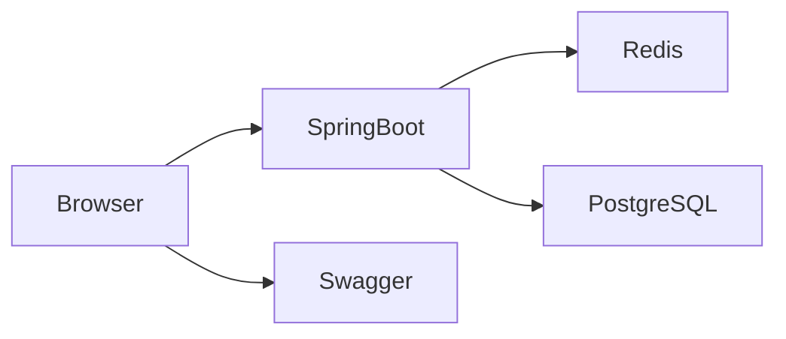

# LinkTrim

LinkTrim is a production-style modular monolith URL shortener built with Java 21, Spring Boot 3, PostgreSQL, Redis, Flyway, Docker Compose, and Springdoc OpenAPI.

## Frontend overview

The LinkTrim dashboard is served directly by Spring Boot at:

```text
http://localhost:8080/
```

The browser UI is implemented as plain HTML, CSS, and vanilla JavaScript inside the app's static resources. There is no separate frontend service or Node ecosystem; the same Spring Boot service serves the dashboard, API, and static assets from the same origin.

## Local URLs

- Frontend: http://localhost:8080/
- Swagger UI: http://localhost:8080/swagger-ui/index.html (developer/documentation endpoint)
- Health: http://localhost:8080/actuator/health

## Browser usage flow

1. Open the LinkTrim dashboard at http://localhost:8080/.
2. Paste a long URL and optionally set an expiration date.
3. Click Trim URL to create a short link.
4. Copy, open, or inspect its analytics from the result area.
5. Use the analytics panel to view click counts and timestamps.
6. Delete the link from the danger section when needed.

## Architecture

The frontend is part of the same Spring Boot modular monolith as the backend. Browser requests are relative to the same origin, and the application serves static files plus API routes directly from the container at port 8080.



## Plain HTML/CSS/JavaScript implementation

The LinkTrim frontend uses:

- HTML for structure and semantics
- CSS variables and reusable layout patterns for the premium orange-and-blue LinkTrim dashboard
- vanilla JavaScript for API calls, form validation, analytics rendering, and notifications
- inline SVG for the custom LinkTrim mark and iconography

No separate frontend service, React, Vue, Node.js, or external CDN assets are used.

## Backend flow

```text
Browser → Spring Boot static UI/API → Redis → PostgreSQL
```

- PostgreSQL is the source of truth.
- Redis accelerates redirect lookups and cached metadata reads.
- Base62 creates compact, deterministic public URLs.
- The frontend belongs to the same Spring Boot monolith and is deployed with the backend, not as an independent app.

## Base62 explanation

LinkTrim generates a compact code by taking the numeric primary key used in PostgreSQL and encoding it using the Base62 alphabet:

`0123456789abcdefghijklmnopqrstuvwxyzABCDEFGHIJKLMNOPQRSTUVWXYZ`

This produces short, readable codes while avoiding random or UUID-based visible identifiers.

## Local setup commands

```bash
set JAVA_HOME=C:\Program Files\Java\jdk-21.0.12.1
set PATH=%JAVA_HOME%\bin;%PATH%

mvn clean verify
mvn spring-boot:run
```

## Docker startup commands

```bash
docker compose down -v --remove-orphans
docker compose up --build -d
docker compose ps
```

## Production deployment

The application listens on the hosting platform's `PORT` environment variable, falling back to `8080` for local development. Forwarded headers are enabled so short URLs created behind a reverse proxy use the original public scheme and host. If the proxy does not provide reliable forwarded headers, set `APP_BASE_URL` to the public origin, for example `https://links.example.com` (without a trailing slash).

Configure these environment variables in the hosting platform rather than committing credentials:

- `PORT`: supplied by the platform
- `APP_BASE_URL`: optional public HTTPS origin; if unset, the request origin is used
- `SPRING_DATASOURCE_URL`, `SPRING_DATASOURCE_USERNAME`, `SPRING_DATASOURCE_PASSWORD`: managed PostgreSQL connection details
- `SPRING_DATA_REDIS_HOST`, `SPRING_DATA_REDIS_PORT`: managed Redis connection details
- `SPRING_DATA_REDIS_PASSWORD`: set only when required by the Redis provider

Docker Compose is configured for local use and connects to its database and Redis services by the `postgres` and `redis` service names. Its local `APP_BASE_URL` default is for development only. The existing multi-stage `Dockerfile` builds and runs the Spring Boot application; no separate frontend container is needed.

After deployment, create a short URL and confirm the returned `shortUrl` starts with the deployed HTTPS origin. Also verify the root page, `/actuator/health`, the redirect, analytics, and deletion using that same public domain. Do not treat a successful local Docker run as deployment verification.

## API endpoints

- POST /api/v1/urls
- GET /{shortCode}
- GET /api/v1/urls/{shortCode}/stats
- DELETE /api/v1/urls/{shortCode}
- GET /actuator/health
- GET /v3/api-docs
- GET /swagger-ui/index.html

## Design notes

This application stays intentionally simple and readable. The monolith keeps operations predictable, while Redis handles short-lived redirect caching and PostgreSQL remains the canonical datastore for URL metadata and analytics.
