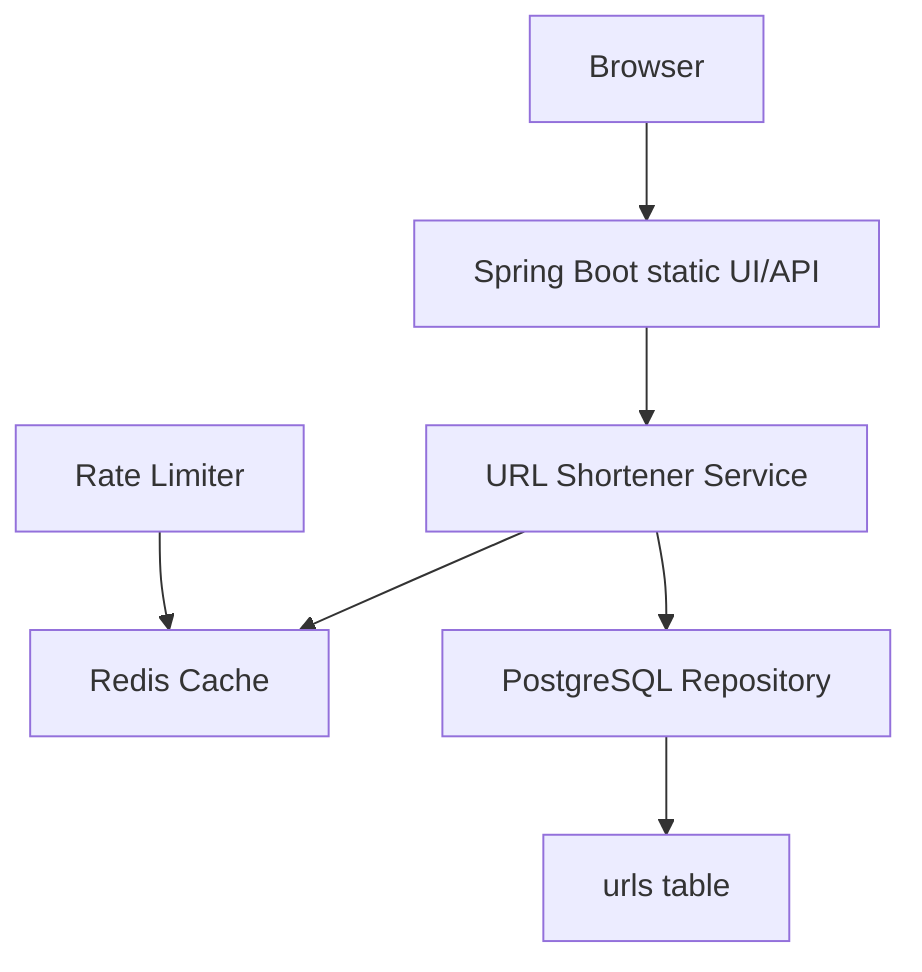

# System Design

## Requirements

This project implements a LinkTrim URL shortener with:

- Creating URLs with optional expiration dates.
- Redirecting with Redis cache-first behavior.
- Expired URL rejection with HTTP 410.
- Statistics retrieval and deletion.
- Redis-based per-IP rate limiting.
- PostgreSQL persistence and Flyway migration.

## Functional requirements

- Create, redirect, stats, and delete short URLs.
- Validate request payloads and short-code format.
- Use deterministic Base62 codes generated from database IDs.
- Protect against duplicate codes and lost-click updates.
- Return centralized JSON errors for all supported failure conditions.

## Non-functional requirements

- Java 21 and Spring Boot 3.x
- Docker-friendly local deployment
- Safe defaults for local config
- Clear service boundaries and small controllers
- No secrets committed to source control

## High-level architecture



The browser UI is served by the same Spring Boot application. It is not a separate microservice; the browser sends relative requests to the API and the application serves static files and API endpoints from the same container. The application binds to the platform-provided `PORT` environment variable, defaulting to port 8080 for local development.

Short URLs use `APP_BASE_URL` when explicitly configured; otherwise, the public origin is derived from the current request. Framework forwarded-header support allows reverse-proxy HTTPS and host headers to be honored. Inside Docker Compose, PostgreSQL and Redis are addressed by their service names, not by localhost.

## Frontend flow

```text
Browser → Spring Boot static UI/API → Redis → PostgreSQL
```

The static frontend uses plain HTML, CSS, and JavaScript. API calls remain relative to the same origin so the UI works in Docker Compose and local Spring Boot execution without CORS or a separate frontend service.

Developer-facing API documentation remains available at `/swagger-ui/index.html` and `/v3/api-docs` on the same Spring Boot application, but it is not presented as a primary product feature in the public website navigation. PostgreSQL is the source of truth, while Redis accelerates redirect lookups and cache misses. The frontend belongs to the same Spring Boot modular monolith as the backend. There is no separate frontend deployment.

## Request flows

### Creation flow

1. Validate original URL and expiration.
2. Check rate limit by client IP.
3. Save the URL in PostgreSQL.
4. Generate short code from the generated ID.
5. Return the final URL metadata.

### Redirect flow

1. Validate short code.
2. Check Redis and verify expiration.
3. Fallback to PostgreSQL.
4. Cache new entries.
5. Update click analytics atomically.
6. Return HTTP 302 redirect.

## Database design

The database retains the canonical URL data only. The short code is unique and indexed for efficient lookup. The expiration index supports pruning and expired checks. Click analytics and last-access timestamps are stored in the same row for accurate tracking.

## Base62 strategy

Base62 conversion uses the exact alphabet:

`0123456789abcdefghijklmnopqrstuvwxyzABCDEFGHIJKLMNOPQRSTUVWXYZ`

This keeps codes short, deterministic, and safe for URLs while avoiding random or UUID-based visible identifiers.

## Redis caching

Redis caches only the canonical redirect mapping and metadata, not the database state itself. TTL is based on the shorter of the configured default and the remaining URL lifetime. Delete operations invalidate the key immediately. An expired cache entry is treated as invalid even if stale JSON still exists.

## Rate limiting

A fixed-window limiter uses Redis counters keyed by client IP. This is lightweight and appropriate for local validation and low-to-moderate production usage.

## Concurrency

- PostgreSQL handles uniqueness enforcement.
- Click counts increment with atomic SQL updates.
- Short-code generation follows a safe transactional pattern using the generated ID.
- Cache refreshes and deletions are single-key operations.

## Failure scenarios

- Invalid URL: 400
- Short code missing or malformed: 400 or 404 as appropriate
- Expired redirect request: 410
- Duplicate insert: 409
- Rate limit exceeded: 429
- Data store down: 500 with sanitized payload

## Scaling strategy

This is a modular monolith designed to scale vertically before scaling horizontally. A future distributed deployment could add read replicas, a dedicated cache cluster, and dedicated analytics workers.

## Bottlenecks

- Database writes for URL creation and click updates
- Cache invalidation consistency across nodes
- Rate limit contention in Redis under very high load

## Trade-offs

The chosen design keeps dependencies limited, operational complexity manageable, and the code straightforward. It deliberately avoids more advanced distributed coordination because the current requirement is a single-service deployment model.

## Future improvements

- Multi-region cache replication
- Background expired-record cleanup
- More advanced analytics retention and aggregation
- Sharded or partitioned database strategy if traffic grows substantially
